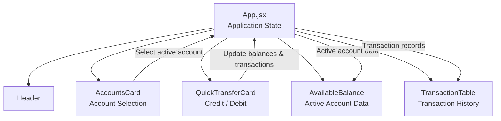

# Banking Dashboard

A responsive financial dashboard template built with React and mock data. Users can switch between accounts, view available balances, manage credit and debit activity, track transactions, and simulate peer-to-peer (P2P) transfers.

The application demonstrates a realistic banking dashboard experience with reusable React components, dynamic state updates, transaction tracking, and responsive layouts.

## Table of Contents

- [Live Demo](#live-demo)
- [Features](#features)
- [Tech Stack](#tech-stack)
- [How It Works](#how-it-works)
- [Key Functionality](#key-functionality)
  - [Account Selection](#account-selection)
  - [Credit](#credit)
  - [Debit](#debit)
  - [Transaction History](#transaction-history)
- [Project Structure](#project-structure)
- [Getting Started](#getting-started)
- [Deployment](#deployment)
- [Technical Highlights](#technical-highlights)
- [SEO](#seo)
- [References](#references)
- [Author](#author)

## Live Demo

Click on preview image to visit live demo

[](https://hadiashah01.github.io/bank-account-manager/)

## Features

- Banking dashboard interface
- Checking, Savings, and Credit account cards
- Dynamic active-account selection
- Available balance display
- Quick Credit functionality
- Quick Debit / account-to-account transfers
- Simulated P2P fund transfers
- Dynamic account balance updates
- Transaction history
- Daily credit and debit limits
- Reusable React components
- Controlled form inputs
- Horizontal scrolling for account cards and tables where required
- SEO metadata with JSON-LD structured data

## Tech Stack

- **React**
- **JavaScript (ES6+)**
- **Vite**
- **CSS3**
- **Flexbox**
- **Font Awesome**
- **Google Fonts**

## How It Works

The application keeps the main account state in `App.jsx`.

Account data and functionality are passed to child components through props.



The active account is selected from `AccountsCard`, while components such as `AvailableBalance`, `QuickTransferCard`, and `TransactionTable` display or modify data related to that account.

## Key Functionality

### Account Selection

Users can select an account from the account cards. The selected account becomes the active account, and the relevant account information is displayed throughout the dashboard.

### Credit

The Credit functionality:

- Adds funds to the active account.
- Updates the account balance.
- Records the transaction.
- Applies the configured daily credit limit.

### Debit

The Debit functionality:

- Deducts funds from the active account.
- Transfers the amount to the selected target account.
- Updates both account balances.
- Records the transaction.
- Applies the configured daily debit limit.

### Transaction History

Each account maintains transaction records containing information such as:

- Transaction type
- Updated balance
- Date and time

The transaction data is passed to the transaction table for display.

## Project Structure

```text
bank-account-manager/
│
├── public/
│
├── src/
│   ├── components/
│   │   ├── Header/
│   │   ├── AccountsCard/
│   │   ├── QuickTransferCard/
│   │   ├── AvailableBalance/
│   │   └── TransactionTable/
│   │
│   ├── App.jsx
│   ├── index.css
│   └── main.jsx
│
├── index.html
├── package.json
├── package-lock.json
├── vite.config.js
└── README.md
```

## Getting Started

Clone the repository:

```bash
git clone https://github.com/hadiashah01/bank-account-manager.git
```

Move into the project directory:

```bash
cd bank-account-manager
```

Install dependencies:

```bash
npm install
```

Start the development server:

```bash
npm run dev
```

Create a production build:

```bash
npm run build
```

## Deployment

The application is deployed using GitHub Pages with the `gh-pages` package.

The deployment workflow is configured in `package.json` using two npm scripts:

```json
"predeploy": "npm run build",
"deploy": "gh-pages -d dist"
```

**Running:**

```bash
npm run deploy
```

automatically:

1. Creates the production build using Vite.
2. Generates the `dist` folder.
3. Publishes the contents of `dist` to the `gh-pages` branch.
4. Updates the GitHub Pages deployment.

The project is served from the `gh-pages` branch while the main source code remains in the primary repository branch.

### Deployment Command

```bash
npm run deploy
```

### Live Deployment

[Banking Dashboard — GitHub Pages](https://hadiashah01.github.io/bank-account-manager/)

## Technical Highlights

This project demonstrates:

- React functional components
- `useState` for account and active-account state management
- Passing callback functions between components
- Reusable `createBankAccount()` function for account creation
- Encapsulated account operations using JavaScript functions and closures
- Credit and debit operations with daily transaction limits
- Account-to-account fund transfers
- Dynamic account selection
- Transaction record management
- Array operations using `find()` and the spread operator
- Dynamic account number and IBAN generation
- Getter-based balance access
- Reusable component-based dashboard structure
- Vite production build and GitHub Pages deployment
- JSON-LD structured data

## SEO

The application includes basic SEO metadata such as:

- Page title
- Meta description
- Structured data using JSON-LD

The structured data describes the project as a web application and helps search engines better understand the page.

## References

- [React Documentation](https://react.dev/)
- [Vite Documentation](https://vite.dev/)
- [MDN Web Docs – CSS](https://developer.mozilla.org/en-US/docs/Web/CSS)
- [MDN Web Docs – Flexbox](https://developer.mozilla.org/en-US/docs/Web/CSS/CSS_flexible_box_layout)
- [Font Awesome Documentation](https://fontawesome.com/docs)
- [Google Fonts](https://fonts.google.com/)

## Author

**Hadi Shahjahan**
